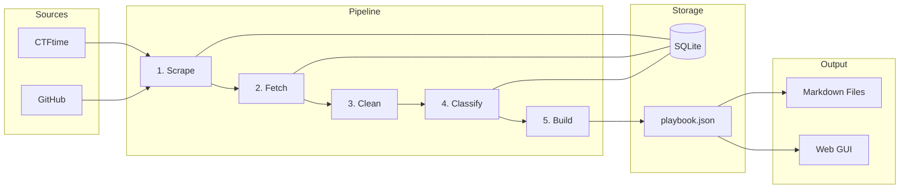

# CTF Playbook Builder

A pipeline that scrapes thousands of CTF (Capture The Flag) writeups from CTFtime and GitHub,
downloads the content, classifies them using an LLM to extract solving techniques/tools/patterns,
and organizes everything into a technique-based playbook designed to help solve new challenges.

## Architecture



### Stages

1. **Scrape** (`ctf_playbook/scrapers/`) — Crawl CTFtime events + tasks + writeup links; discover GitHub repos. Stores metadata in SQLite.
2. **Fetch** (`ctf_playbook/services/fetcher.py`) — Download writeup content (HTML->text via trafilatura, raw markdown). Filters out junk (link indexes, too-short content). Saves to `playbook/raw-writeups/`.
3. **Clean** (automatic) — Runs automatically before classification. Backfills content hashes, removes writeups from excluded repos, re-checks content quality, and deduplicates by content hash. No LLM tokens wasted on junk or duplicates.
4. **Classify** (`ctf_playbook/services/classifier.py`) — Send fetched writeups to Gemini for structured analysis. Extracts: techniques (with sub-techniques), tools, recognition signals, solve steps, difficulty. Stores results as JSON in the DB.
5. **Build** (`ctf_playbook/services/builder.py`) — Three-phase pipeline: assemble structured data from DB, export `playbook.json` (single source of truth), then render browsable markdown files.

## Key Design Decisions

- **Organized by technique within categories.** A heap exploit and a format string bug are both "pwn" but have totally different solve paths. The playbook groups by what-you-actually-do, with optional sub-techniques for finer granularity (e.g., XSS splits into reflected, stored, DOM).
- **Data model first, views second.** The builder assembles a structured `playbook.json` from the database, then renders markdown as one view of that data. The JSON is the single source of truth — a GUI or API can consume it directly without parsing markdown.
- **SQLite as the central index.** Every writeup has a `fetch_status` and `class_status` so you can resume any stage. Content-hash deduplication detects the same writeup found via different sources.
- **Self-improving taxonomy.** `ctf_playbook/taxonomy.py` defines the canonical categories and techniques. The classifier can discover new technique slugs not in the taxonomy — keyword-based inference auto-categorizes them by scoring slug tokens against category keyword sets derived from the taxonomy itself. Adding techniques to the taxonomy automatically expands the keyword index.
- **Automatic cleanup.** Running `classify` or `all` automatically deduplicates and removes junk before spending LLM tokens. No manual `dedup`/`clean` step needed.
- **Layered architecture.** Configuration, taxonomy data, data access (db), and service logic (classify, build, fetch) are separated so a GUI or API can reuse the same services without importing CLI code.

## Setup

```bash
uv sync
```

Set environment variables:
```bash
export GITHUB_TOKEN="ghp_..."        # GitHub personal access token (optional, raises rate limit)
export GEMINI_API_KEY="..."          # Required for the classify stage (free tier available)
```

## Usage

```bash
# Run the full pipeline (scrape -> fetch -> clean/dedup -> classify -> build)
uv run ctf-playbook all

# Or run individual stages
uv run ctf-playbook scrape                      # Discover writeups from select sources
uv run ctf-playbook fetch                       # Download writeup content
uv run ctf-playbook classify                    # Extract techniques via LLM (auto-cleans first)
uv run ctf-playbook build                       # Generate playbook.json + markdown files
uv run ctf-playbook export                      # Export playbook.json only (no markdown)
uv run ctf-playbook export -o out.json          # Export to a custom path
uv run ctf-playbook import ./data/playbook.json # Import a playbook.json for the GUI
uv run ctf-playbook serve                       # Launch the interactive web GUI

# Stage options
uv run ctf-playbook scrape --max-events 100     # Limit CTFtime events
uv run ctf-playbook scrape --source github      # Only scrape GitHub
uv run ctf-playbook fetch --limit 500           # Fetch up to 500 writeups
uv run ctf-playbook classify --limit 100        # Classify up to 100 writeups
uv run ctf-playbook classify --category pwn     # Only classify pwn challenges
uv run ctf-playbook classify --w 10             # Run 10 workers at once

# GUI
uv run ctf-playbook serve                       # Browse the playbook at http://127.0.0.1:8080
uv run ctf-playbook serve --port 3000           # Custom port
uv run ctf-playbook serve --no-browser          # Don't auto-open browser

# Utilities
uv run ctf-playbook stats                       # Database statistics (includes sub-technique breakdown)
uv run ctf-playbook search "heap"               # Search classified writeups by keyword
uv run ctf-playbook search -t buffer-overflow   # Filter by technique
uv run ctf-playbook search --tool gdb           # Filter by tool
uv run ctf-playbook dedup                       # Remove duplicate writeups (by content hash)
uv run ctf-playbook clean                       # Purge junk content from fetched writeups
uv run ctf-playbook fix-categories              # Backfill challenge categories from technique data

# Sub-technique management
uv run ctf-playbook promote                     # Review and promote discovered sub-techniques
uv run ctf-playbook promote --threshold 5       # Require 5+ occurrences
uv run ctf-playbook soft-reset                  # Reset classifications for re-classification
```

## Testing

```bash
uv run pytest
```

## Rate Limiting

- **CTFtime**: 1.5s delay between requests (be respectful)
- **GitHub API**: 5,000 req/hr with token, 60/hr without
- **Blog fetching**: 1s delay per domain, randomized

## Interactive GUI

The playbook includes a local web app for browsing techniques, searching writeups, and exploring tools. It reads directly from `playbook.json` — no external services required.

### Views

- **Dashboard** — Stats cards, category breakdown, difficulty distribution
- **Technique Detail** — Recognition signals, tools, solve flow, cross-references, sub-technique cards, example writeups
- **Category Overview** — Sortable table of techniques with writeup counts, difficulty, sub-techniques
- **Recon Patterns** — Per-category recognition patterns for quick triage during CTFs
- **Search** — Full-text search with filters by technique, tool, and difficulty
- **Tool Reference** — Searchable table of tools with usage counts and linked techniques
- **Sidebar Tree** — Persistent taxonomy navigation grouped by category, with sub-technique deep links

The GUI also exposes a JSON API at `/api/stats`, `/api/techniques`, `/api/technique/{slug}`, and `/api/search` for programmatic access.

## Taxonomy Design

The playbook is organized by **technique** (what you do to solve it), grouped under top-level
categories. This means a "pwn" challenge using heap exploitation and a "pwn" challenge using
format strings live in different technique branches, because the solve paths are different.

### Hierarchy

The taxonomy has up to 3 levels: **category / technique / sub-technique**.

```
playbook/techniques/
  cryptography/
    rsa-attacks/
      _pattern.md              # Technique overview + sub-technique table
      _recon.md                # Decision tree: which RSA sub-technique?
      coppersmith.md           # Sub-technique pattern file
      wiener.md
      hastad.md
    padding-oracle/
      _pattern.md              # No sub-techniques — just the overview
  web/
    xss/
      _pattern.md
      _recon.md                # Decision tree: reflected vs stored vs DOM?
      reflected-xss.md
      stored-xss.md
      dom-xss.md
```

- `_pattern.md` — technique overview with recognition signals, tools, solve flow, examples, and cross-references ("See Also" links to related techniques)
- `_recon.md` — decision tree for techniques with 2+ sub-techniques, helping distinguish which sub-technique applies based on observable signals
- `{sub-technique}.md` — same structure as `_pattern.md`, scoped to a specific sub-technique
- Not all techniques have sub-techniques — most are just `_pattern.md`

### Cross-References

The builder mines co-occurring techniques from writeups (challenges that use multiple techniques together) and adds "See Also" sections to pattern files. For example, if `padding-oracle` and `cbc-bit-flipping` frequently appear together, each technique's pattern file will link to the other. This helps when one approach doesn't work — you can quickly pivot to related techniques.

### Category Inference

Techniques discovered by the classifier that aren't in the canonical taxonomy are auto-categorized using keyword-based inference. Slug tokens are scored against per-category keyword sets derived from:
1. Existing taxonomy technique slugs (e.g., "heap" from `heap-exploitation` scores for binary-exploitation)
2. Domain-specific supplements (e.g., "php", "dom" for web; "ecdsa", "nonce" for cryptography)

Tokens appearing in 3+ categories are pruned as too generic. Ties between two non-misc categories return unknown (stays in misc). This is self-improving — adding techniques to the taxonomy automatically expands the keyword index.

### Sub-Technique Discovery

Sub-techniques come from two sources:
1. **Seeded** — predefined in the taxonomy (e.g., RSA attack variants, XSS types)
2. **Discovered** — the classifier identifies new sub-techniques during classification

Discovered sub-techniques are tracked in the database with occurrence counts. Once a
sub-technique appears in 3+ writeups, it becomes a **promotion candidate**. Use
`ctf-playbook promote` to review and approve candidates.

### Playbook Data Model

The build stage produces `playbook.json` as the single source of truth. Structure:

```json
{
  "metadata": { "generated_at": "...", "technique_count": 140, ... },
  "techniques": {
    "buffer-overflow": {
      "category": "binary-exploitation",
      "signals": ["stack smashing", "segfault on input"],
      "tools": ["gdb", "pwntools", "checksec"],
      "solve_steps": ["Check protections", "Find offset", ...],
      "examples": [{ "challenge": "...", "event": "...", "year": 2024, "url": "..." }],
      "cross_references": [{ "technique": "rop-chains", "count": 5 }],
      "sub_techniques": { ... }
    }
  },
  "recon_patterns": { ... },
  "tool_reference": [ ... ]
}
```

Markdown files are rendered from this data. A GUI or API can consume `playbook.json` directly.
